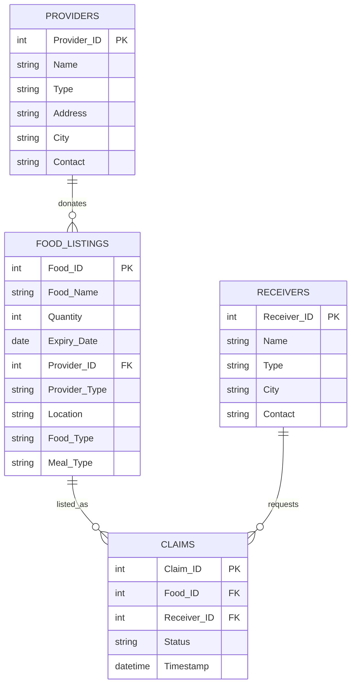

# Food Waste Management System — Data Schema

## Entity Relationship Overview



## Table Definitions

### `providers`

| Column | Type | Constraints | Description |
|--------|------|-------------|-------------|
| `Provider_ID` | INTEGER | PRIMARY KEY | Unique donor identifier |
| `Name` | VARCHAR(255) | NOT NULL | Business or organization name |
| `Type` | VARCHAR(50) | NOT NULL | Supermarket, Grocery Store, Restaurant, Catering Service |
| `Address` | TEXT | NOT NULL | Full street address |
| `City` | VARCHAR(100) | NOT NULL | City where provider operates |
| `Contact` | VARCHAR(50) | NOT NULL | Phone or contact number |

**Record count:** 1,000

---

### `receivers`

| Column | Type | Constraints | Description |
|--------|------|-------------|-------------|
| `Receiver_ID` | INTEGER | PRIMARY KEY | Unique receiver identifier |
| `Name` | VARCHAR(255) | NOT NULL | Person or organization name |
| `Type` | VARCHAR(50) | NOT NULL | NGO, Charity, Shelter, Individual |
| `City` | VARCHAR(100) | NOT NULL | City where receiver operates |
| `Contact` | VARCHAR(50) | NOT NULL | Phone or contact number |

**Record count:** 1,000

---

### `food_listings`

| Column | Type | Constraints | Description |
|--------|------|-------------|-------------|
| `Food_ID` | INTEGER | PRIMARY KEY | Unique food listing identifier |
| `Food_Name` | VARCHAR(100) | NOT NULL | Item name (Bread, Rice, Soup, etc.) |
| `Quantity` | INTEGER | NOT NULL, > 0 | Units available for donation |
| `Expiry_Date` | DATE | NOT NULL | Best-before or use-by date |
| `Provider_ID` | INTEGER | FK → providers | Donating provider |
| `Provider_Type` | VARCHAR(50) | NOT NULL | Denormalized provider category |
| `Location` | VARCHAR(100) | NOT NULL | City where food is listed |
| `Food_Type` | VARCHAR(50) | NOT NULL | Vegan, Vegetarian, Non-Vegetarian |
| `Meal_Type` | VARCHAR(50) | NOT NULL | Breakfast, Lunch, Dinner, Snacks |

**Record count:** 1,000  
**Total quantity:** 25,794 units

---

### `claims`

| Column | Type | Constraints | Description |
|--------|------|-------------|-------------|
| `Claim_ID` | INTEGER | PRIMARY KEY | Unique claim transaction ID |
| `Food_ID` | INTEGER | FK → food_listings | Food being claimed |
| `Receiver_ID` | INTEGER | FK → receivers | Organization/person claiming food |
| `Status` | VARCHAR(20) | NOT NULL | Completed, Pending, Cancelled |
| `Timestamp` | DATETIME | NOT NULL | Claim event timestamp |

**Record count:** 1,000  
**Date range:** 2025-03-01 to 2025-03-21

---

## Relationships & Join Keys

| From | To | Join Key | Cardinality |
|------|----|----------|-------------|
| `food_listings` | `providers` | `Provider_ID` | Many-to-one |
| `claims` | `food_listings` | `Food_ID` | Many-to-one |
| `claims` | `receivers` | `Receiver_ID` | Many-to-one |

### Analytical View: `vw_claims_enriched`

A denormalized view joining all four tables for dashboard and reporting:

```
claims
  LEFT JOIN food_listings  ON Food_ID
  LEFT JOIN providers      ON Provider_ID
  LEFT JOIN receivers      ON Receiver_ID
```

## Data Quality Notes

- **Completeness:** No null values detected across all four datasets.
- **Referential integrity:** All foreign keys in claims and food_listings resolve to valid parent records.
- **Denormalization:** `Provider_Type` and `Location` on `food_listings` duplicate provider attributes for query performance.
- **Status distribution:** Claims are evenly split (~34% Completed, ~34% Cancelled, ~32% Pending), indicating operational friction.

## Business Metrics (Derived)

| Metric | Formula | Current Value |
|--------|---------|---------------|
| Food Rescue Rate | Completed-claim food qty ÷ Total listed qty | 28.4% |
| Claim Success Rate | Completed claims ÷ Total claims | 33.9% |
| Cancellation Rate | Cancelled claims ÷ Total claims | 33.6% |
