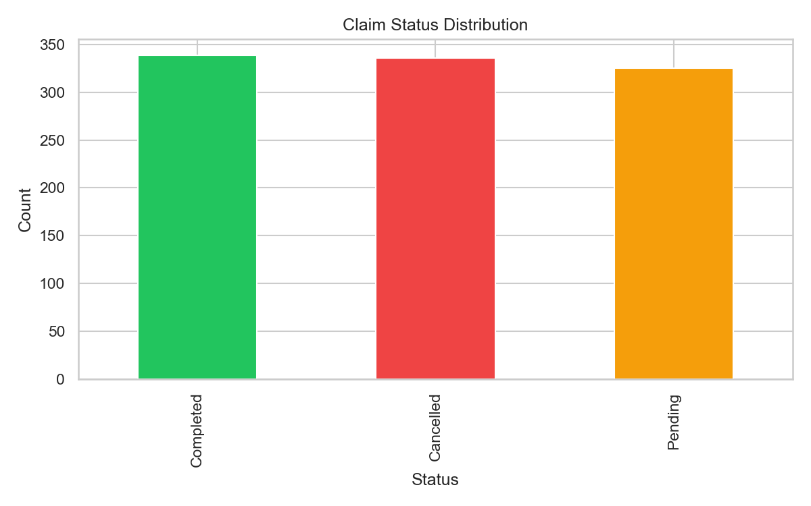
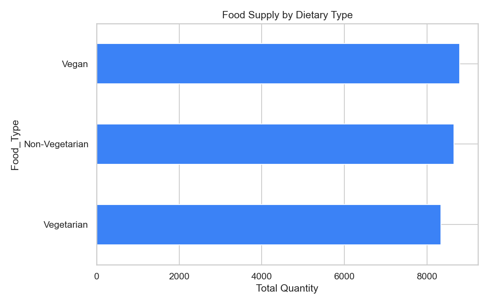
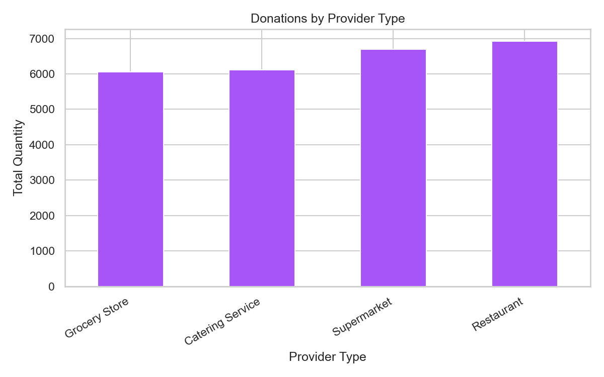
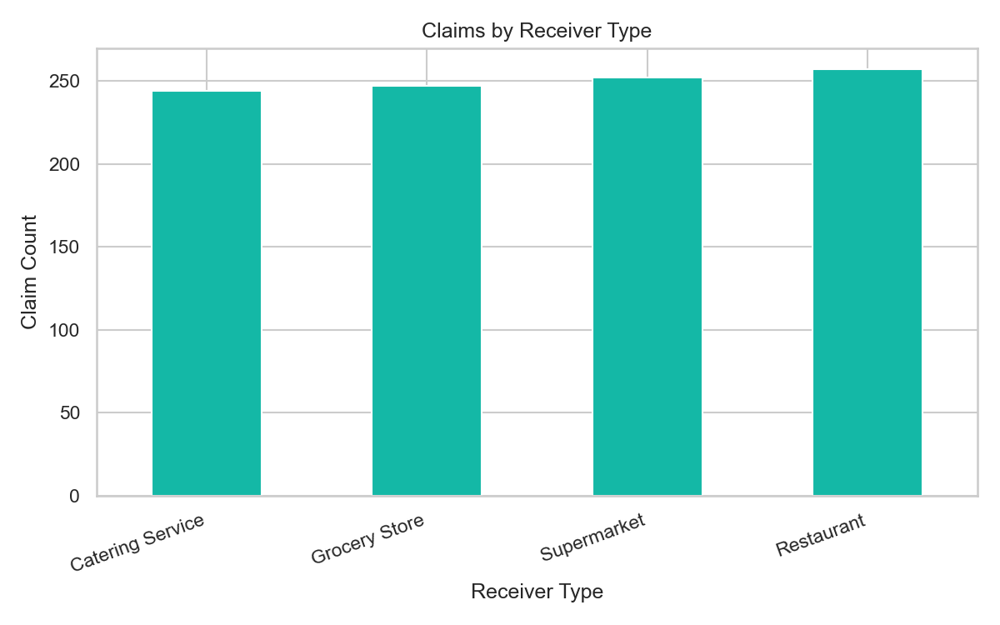
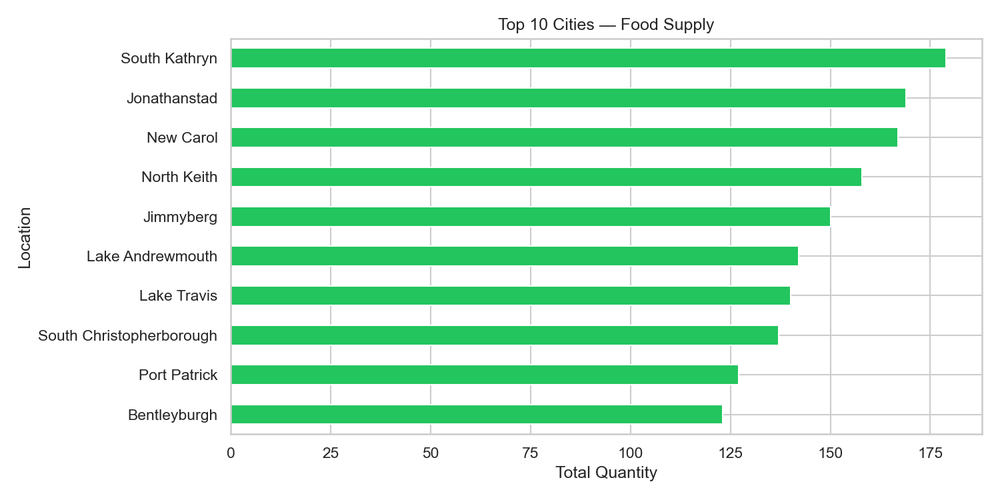
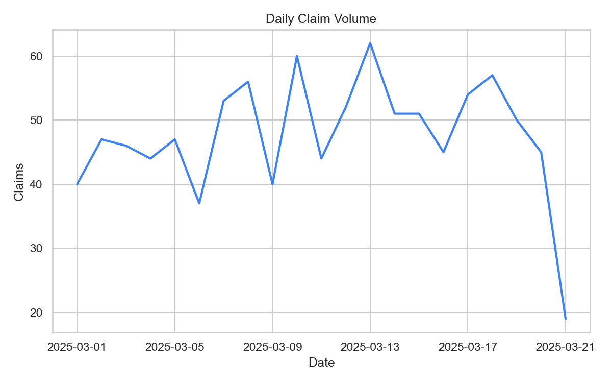

# Exploratory Data Analysis Report
## Food Waste Management System

**Generated:** Automated EDA pipeline (`src/eda.py`)

---

## 1. Executive Summary

This analysis covers **1,000 claims**, **1,000 food listings**, **1,000 providers**, and **1,000 receivers** over the period **2025-03-01** to **2025-03-21**.

| KPI | Value |
|-----|-------|
| Total Food Units Listed | 25,794 |
| Food Rescue Rate | 28.4% |
| Claim Success Rate | 33.9% |
| Cancellation Rate | 33.6% |
| Cities with Supply | 624 |

**Key finding:** Only **28.4%** of listed food is successfully rescued. With **33.6%** of claims cancelled and **325** still pending, the platform has significant operational friction that warrants process optimization.

---

## 2. Dataset Overview

| Dataset | Rows | Columns | Null Rate |
|---------|------|---------|-----------|
| Providers | 1,000 | 6 | 0% |
| Receivers | 1,000 | 5 | 0% |
| Food Listings | 1,000 | 9 | 0% |
| Claims | 1,000 | 5 | 0% |

All datasets are complete with no missing values. Referential integrity between foreign keys is intact.

---

## 3. Claim Status Analysis

| Status | Count | Share |
|--------|-------|-------|
| Completed | 339 | 33.9% |
| Cancelled | 336 | 33.6% |
| Pending | 325 | 32.5% |

Claims are nearly evenly distributed across all three statuses, indicating systemic bottlenecks rather than isolated failures.

---

## 4. Food Supply Analysis

### By Dietary Type
| Food_Type      |   Quantity |
|:---------------|-----------:|
| Vegan          |       8798 |
| Non-Vegetarian |       8656 |
| Vegetarian     |       8340 |

### By Provider Type
| Provider_Type    |   Quantity |
|:-----------------|-----------:|
| Restaurant       |       6923 |
| Supermarket      |       6696 |
| Catering Service |       6116 |
| Grocery Store    |       6059 |

**Insight:** Restaurants and supermarkets contribute the largest share of donations. Catering services are also a major source.

---

## 5. Receiver Demand Analysis

### Claims by Receiver Type
| Type       |   Claims |
|:-----------|---------:|
| NGO        |      272 |
| Charity    |      268 |
| Individual |      230 |
| Shelter    |      230 |

NGOs and charities drive the majority of claim activity, followed by shelters and individuals.

---

## 6. Geographic Analysis

Top supply cities show concentration in a handful of urban areas, suggesting targeted outreach could improve rescue rates in underserved regions.

---

## 7. Temporal Trends

Claim volume remains relatively stable across the observation window with no pronounced seasonality in this sample.

---

## 8. Recommendations

1. **Reduce cancellations** — At 33.6%, nearly one in three claims fails. Implement expiry alerts and automated matching.
2. **Accelerate pending claims** — 325 claims are unresolved; introduce SLA tracking and receiver notifications.
3. **Geographic rebalancing** — Concentrate receiver outreach in high-supply, low-demand cities.
4. **Provider partnerships** — Double down on restaurant and supermarket partnerships that drive the highest donation volumes.

---

## 9. Generated Charts

- `claim_status.png`
- `food_type_supply.png`
- `provider_type_supply.png`
- `receiver_type_claims.png`
- `top_cities_supply.png`
- `claims_over_time.png`

---

*Report generated by `src/eda.py`. See `SCHEMA.md` for data dictionary and `sql/` for analytical queries.*
